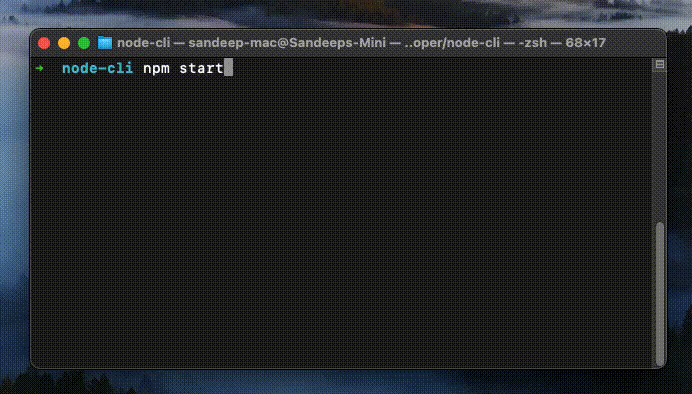
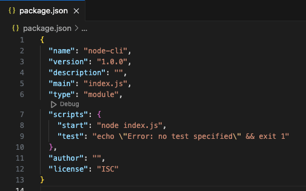
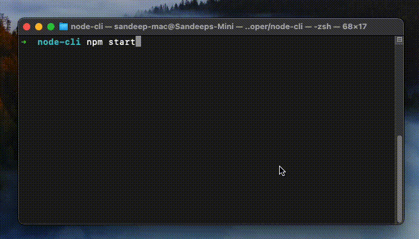

Let's face it, not all applications need to have a GUI. Especially when it comes to a large enterprise work enviornment, you are limited by the resources provided to your team. Whether it is time, user runtime or both.

In this step-by-step guide we will learn how to create an interactive `nodejs` command line application which fetches quote of the day, displays the result in fancy ASCII art, asks user whether they want to save the quote by writing to the file system. And we will also work with javascript `Promises` along the way.

## Demo TL;DR

This is what we will be building:



## Requirement

1. When the application starts, a random quote is fetched from an API.
2. While the quote is being fetched, we will display a loading text with spinner using `ora` package.
3. The quote will be displayed in an attractive manner using the `boxen` package.
4. In the end we will prompt a confirm question to the user to save the quote in `json` format by using `inquirer` package.

## Setup Project

Create a new folder for e.g. `node-cli` and navigate into it using your favourite terminal.

Run `npm init` and follow the prompts.

Open the newly created directory in your favourite IDE and open the `package.json` file. We will add a starter script and define the type as `module` for easy importing.

Your `package.json` should look like this initially:



Create a `index.js` file in the same place as your `package.json`. This will be the entry point to our application. For now just save it with `console.log("Hello, world!");`.

Open your terminal at `node-cli` folder and run the command `npm start`. If everything is correctly configured, terminal will say "Hello, world!" as below:



Now that's out of the way, let's start building.

### Importing required packages

```shell
npm install inquirer ora boxen uuid
```

### Defining utilities and questions

Create a new folder `src` in the root directory. Inside this folder we will create two new files. `utilities.js` will contain our helper functions which we will call from `index.js`. Helper functions include fetching a random quote from API and saving the quote to filesystem in a `json` file. The other file will be `questions.js` which will contain the confirm prompt to the user, whether they want to save the quote or not.

In the `utilities.js` file we will call the [Zen Quotes](https://zenquotes.io/) API to fetch a random quote. In order to simulate that the API is taking time, we will wrap this as a `Promise` which resolves after 5 seconds.

```javascript
// ./src/utilities.js
export function getRandomQuote() {
  return new Promise(async (resolve, reject) => {
    let resp = await fetch("https://zenquotes.io/api/random");
    let quote = await resp.json();
    setTimeout(function () {
      resolve(quote);
    }, 5000);
  });
}
```

In the `index.js` file, we will first display a spinner which says that the quote is being fetched from the internet. To display the spinner we will make use of a package called `ora`. To display the quote in a fancy manner we will use `boxen`.

```javascript
// index.js
import * as utils from "./src/utilities.js";
import ora from "ora";
import boxen from "boxen";

let spinner = ora("Fetching quote from the internet...").start();
let quote = await utils.getRandomQuote();
spinner.succeed("Quote fetched:");

console.log(
  boxen(`${quote[0].q}`, {
    title: `${quote[0].a}`,
    padding: 1,
    margin: 1,
    borderStyle: "round",
  })
);
```

**Note:** As `utils.getRandomQuote()` returns a promise, we can await the response and essentially block the execution till the quote is received.

### Ask a question

Now let's add the functionality of asking a question. In the `questions.js` file we will add a new export function as follows:

```javascript
// ./src/questions.js
import inquirer from "inquirer";

export function confirmSave() {
  return inquirer.prompt([
    {
      name: "confirm",
      message: "Do you want to save this quote?",
      type: "list",
      choices: ["Yes", "No"],
    },
  ]);
}
```

**Note:** You can ask multiple questions in a single prompt. Note how `inquirer.prompt` is taking an array of objects as input.

Here in the exported function `confirmSave()` we are returning the result of a prompt. The property `name` is the key of the user's answer. `inquirer.prompt` is internally a promise, hence in the `index.js` file we can call it as below:

```javascript
let confirmResp = await questions.confirmSave();
```

Let's create another function in the `utilities.js` file to save the quote in `json` format in local file.

```javascript
// ./src/utilities.js
import fs from "fs";
import { v4 as uuidv4 } from "uuid";

export function getRandomQuote() { ...
}

export async function saveQuote(quote, author) {
    let path = "data/quotes.json";

    if(!fs.existsSync(path)) {
        // file does not exist, create one
        if(!fs.existsSync("data")) {
            // folder does not exist, create one
            fs.mkdirSync("data");
        }
        let id = await uuidv4();
        let data = {};
        data[id] = {
            quote: quote,
            author: author
        };
        let dataString = JSON.stringify(data);
        fs.writeFileSync(path, dataString, "utf-8");
    } else {
        // file exists, append quote
        let dataString = fs.readFileSync(path);
        let id = await uuidv4();
        let data = JSON.parse(dataString);
        data[id] = {
            quote: quote,
            author: author
        };
        dataString = JSON.stringify(data);
        fs.writeFileSync(path, dataString, "utf-8");
    }
    return true;
}
```

Here we are using `nodejs` filesystem API to interact with the local file. Also, we are using `uuid` to generate an ID for our quote.

Finally, in our `index.js` we will have the following:

```javascript
// index.js
import * as questions from "./src/questions.js";
import * as utils from "./src/utilities.js";
import ora from "ora";
import boxen from "boxen";

let spinner = ora("Fetching quote from the internet...").start();
let quote = await utils.getRandomQuote();
spinner.succeed("Quote fetched:");

console.log(
  boxen(`${quote[0].q}`, {
    title: `${quote[0].a}`,
    padding: 1,
    margin: 1,
    borderStyle: "round",
  })
);

let confirmResp = await questions.confirmSave();

if (confirmResp.confirm.toUpperCase() == "YES") {
  let spinner = ora("Saving quote").start();
  let saved = await utils.saveQuote(quote[0].q, quote[0].a);
  if (saved) {
    spinner.succeed("Quote saved");
  } else {
    spinner.fail("Could not save quote");
  }
} else {
  // exit
}
```

So there you have it. We have covered each fo the basic interactivity we are used to seeing in modern command line applications. The packages used are linked below for further reference:

- [inquirer](https://www.npmjs.com/package/inquirer)
- [boxen](https://www.npmjs.com/package/boxen)
- [ora](https://www.npmjs.com/package/ora)
- [uuid](https://www.npmjs.com/package/uuid)
